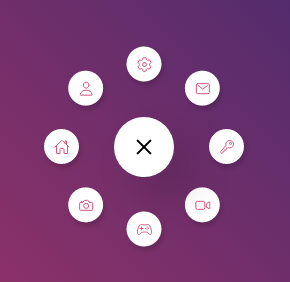

# Menu-circular

  - Trata-se de um menu circular suspenso.

  
  

# Tecnologias usadas:

  - js
    - Manipulação do dom
    - Adicionar e remover classes
  - HTML
  - Css
    - Transitions
    - positions
    - Transforms
